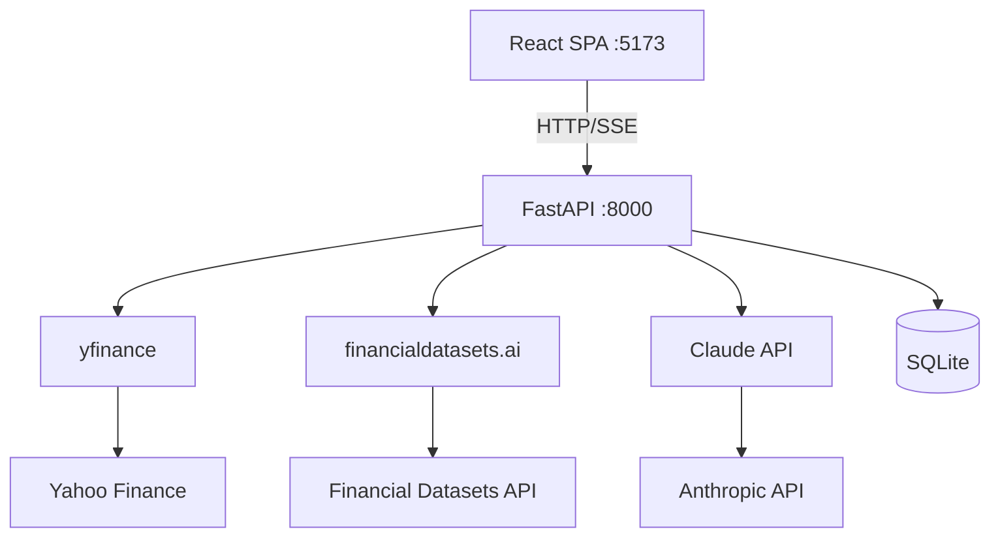

# AlphaDesk — System Architecture

## High-Level Architecture

## Data Flow
1. Frontend makes API calls via React Query (with caching/staleTime)
2. Backend fetches live data from yfinance / financialdatasets.ai
3. For AI features, backend constructs prompts with pre-fetched data + base analyst persona
4. Claude API returns structured JSON (or SSE stream for weekly report)
5. Results cached in SQLite with configurable TTL
6. Frontend renders with appropriate loading/error/stale states

## Caching Strategy
| Data Type | TTL | Storage |
|-----------|-----|---------|
| Macro quotes | 5 min | React Query |
| Sector data | 5 min | React Query |
| Morning drivers | 4 hours | SQLite + React Query |
| Stock grades | 24 hours | SQLite |
| Weekly reports | Permanent | SQLite |
| Screener results | 4 hours | SQLite |
| Portfolio analysis | On-demand | Not cached |

## Key Design Decisions
- Backend handles ALL external API calls (frontend never calls yfinance/Claude directly)
- SSE streaming only for weekly report (longest-running AI call)
- SQLite sufficient for single-user; schema designed for easy migration to PostgreSQL
- No authentication layer (localhost personal use)
