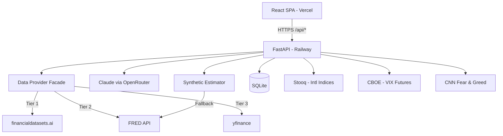

# AlphaDesk — System Architecture

## High-Level Architecture


## Morning Brief /all Data Flow
```
Browser → GET /api/morning-brief/all
  │
  ├─ Batch 1 (3 concurrent, 4s timeout each):
  │   ├─ macro → data_provider.get_macro_data()
  │   ├─ breadth → market_breadth_engine.calculate_breadth()
  │   └─ vix → vix_term_structure.get_vix_term_structure()
  │   └─ [then] regime → regime_detector.detect_regime(macro_result)
  │
  ├─ Batch 2 (4 concurrent, 4s timeout each):
  │   ├─ sectors → yfinance_service.get_sector_chart_data()
  │   ├─ sector_perf → data_provider.get_sector_data()
  │   ├─ transitions → sector_transitions.get_sector_transitions()
  │   └─ rrg → rrg_calculator.calculate_rrg()
  │
  └─ Batch 3+4 (7 concurrent, 4-8s timeout each):
      ├─ sentiment → sentiment_velocity_fast(macro)      ← zero network calls
      ├─ options → options_flow.get_options_flow()
      ├─ earnings → earnings_brief.get_earnings_brief()
      ├─ overnight → synthetic_estimator.estimate(tickers) ← FRED only
      ├─ positioning → cot_positioning.get_cot_positioning()
      ├─ risk → scenario_risk_fast(macro)                 ← zero network calls
      └─ spillover → cross_asset_momentum.get_momentum()
  │
  └─ Return combined JSON → seedApiCache() in frontend
```

## Caching Strategy
| Data Type | Backend Cache | TTL | Frontend Cache |
|-----------|--------------|-----|----------------|
| Macro quotes | In-memory TTLCache | 5 min | React Query (30 min staleTime) |
| Sector data | In-memory TTLCache | 5 min | React Query (30 min) |
| VIX term structure | In-memory TTLCache | 5 min | React Query (30 min) |
| Morning drivers | SQLite | 4 hours | React Query (30 min) |
| Overnight returns | In-memory (daily seed) | Until next day | Pre-cache from /all |
| Sentiment velocity | None (computed) | — | Pre-cache from /all |
| Scenario risk | In-memory TTLCache | 30 min | Pre-cache from /all |
| Stock grades | SQLite | 24 hours | React Query (30 min) |
| Weekly reports | SQLite | Permanent | React Query (1 hour) |
| Portfolio analysis | None | On-demand | React Query (5 min) |

## Frontend Pre-Cache System
```
/api/morning-brief/all response
  │
  └─ seedApiCache() maps each field to an endpoint key:
      '/morning-brief/macro'  → allData.macro
      '/sentiment-velocity'   → allData.sentiment_velocity
      '/scenario-risk'        → allData.scenario_risk
      '/overnight-returns'    → allData.overnight_returns
      ... (16 total mappings)
  │
  └─ api.get() interceptor checks pre-cache before HTTP:
      const cached = _preCache.get(pathOnly);
      if (cached) return { data: cached };  // No network call
      else return originalGet(url);          // Falls back to standalone endpoint
```

## Key Design Decisions
- Backend handles ALL external API calls (frontend never calls data APIs directly)
- Multi-tier data cascade (FDS → FRED → yfinance → synthetic) for resilience
- In-memory TTL caching preferred over SQLite for real-time data (lower latency)
- Synthetic estimation provides directionally accurate data when all live sources fail
- Single `/all` aggregate endpoint eliminates N+1 frontend API calls
- Fast-path functions (`_fast()`) accept pre-fetched data for zero-network-call computation
- Railway 30s proxy timeout is the binding constraint on `/all` endpoint design
- No authentication layer (personal use tool)
- SSE streaming only for weekly report (longest-running AI call)
